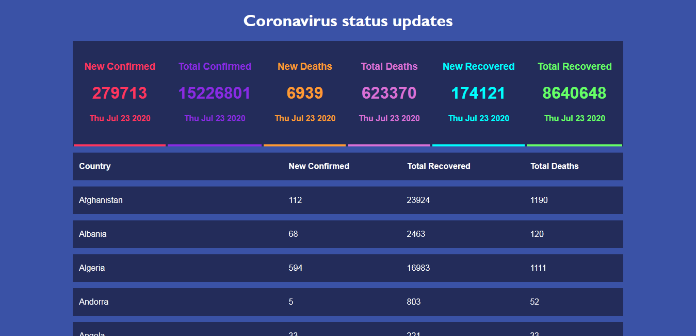
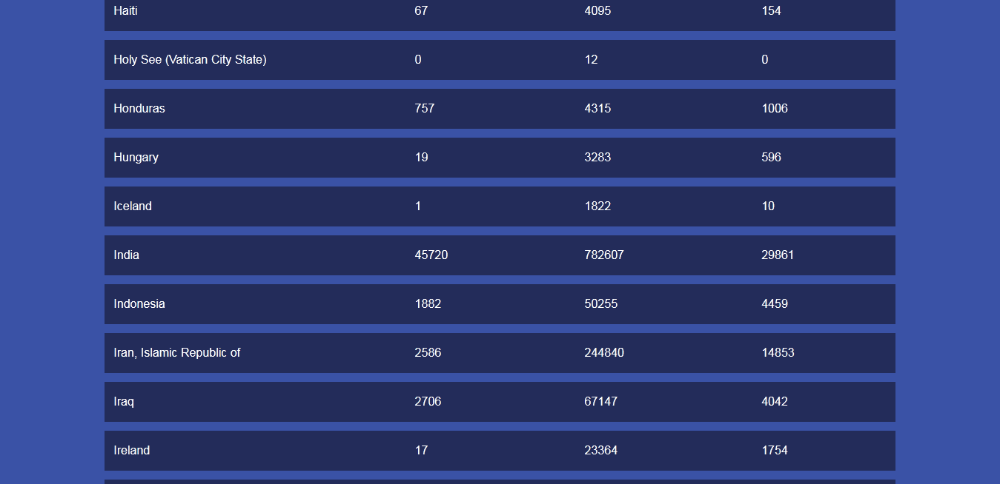

## Coronavirus Country wise status visualizer

React JS project which demonstrates the updated coronavirus statuses of all the countries. The live status is fetched by an api call.

### Screenshots of the application

## API URL 

https://api.covid19api.com/